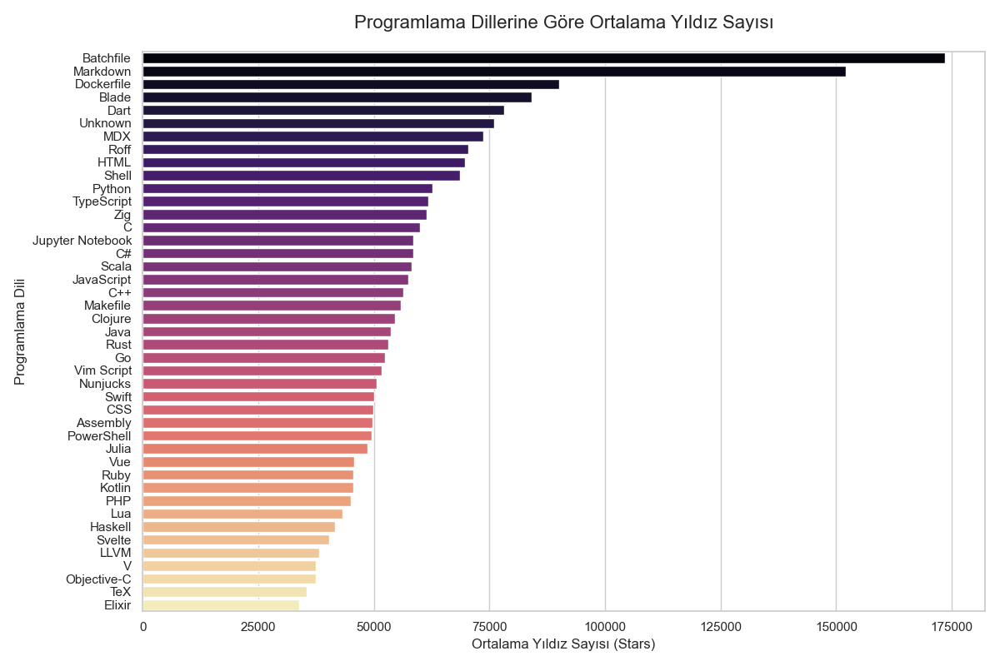
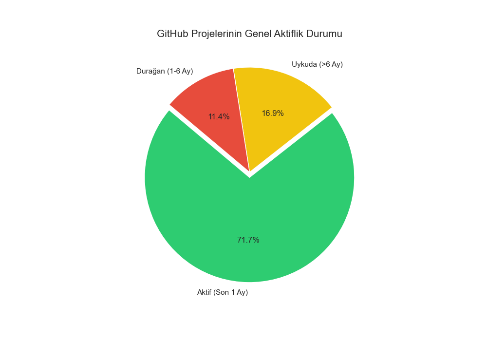
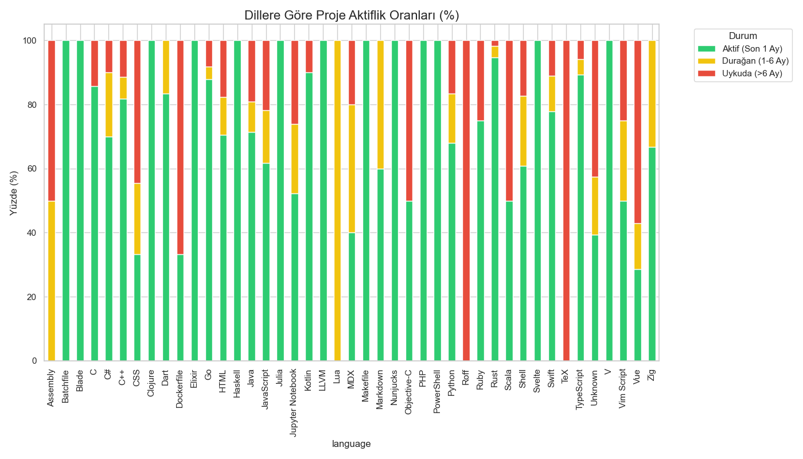
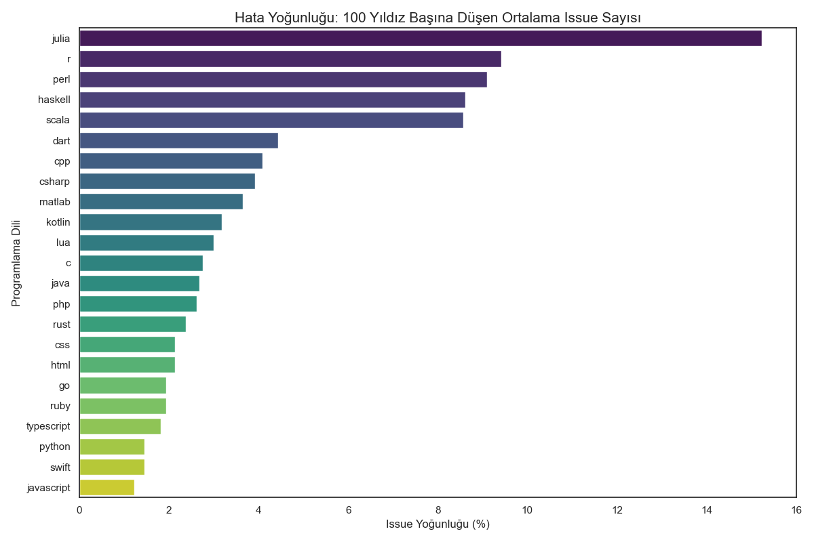
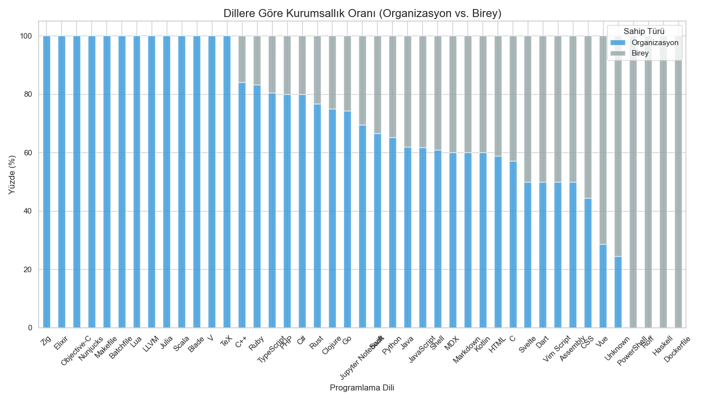
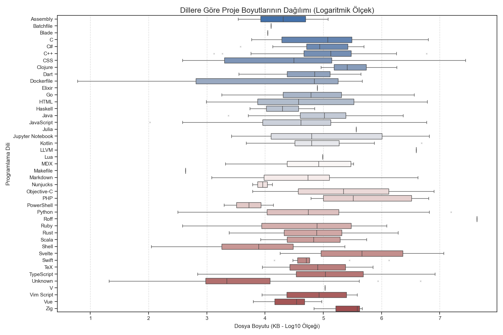

[English Version Click Here](README_EN.md)

# 📊 GitHub Ekosistemi Kapsamlı Veri Analizi Raporu

Bu rapor, GitHub üzerinden toplanan gerçek veriler ve bu verilerden üretilen görselleştirmeler ışığında hazırlanmıştır. Analiz; popülarite trendleri, proje aktifliği, hata yoğunluğu, sahiplik yapısı ve depo boyutlarını kapsamaktadır.

---

## 1. Popülarite Ligi (Ortalama Yıldız Sayısı)
GitHub üzerindeki dillerin popülaritesi, repo başına düşen ortalama yıldız sayısı üzerinden analiz edilmiştir.

**Bulgular:**
* **Yardımcı Araçların Hakimiyeti:** `Batchfile`, `Markdown` ve `Dockerfile` gibi araçlar şaşırtıcı bir şekilde en yüksek ortalama yıldız sayısına sahiptir. Bunun sebebi, bu formatlardaki projelerin genellikle tüm yazılım ekosistemine hitap eden "evrensel rehberler" veya "temel yapılandırmalar" olmasıdır.
* **Ana Akım Diller:** `Python`, `TypeScript` ve `C#` gibi diller çok geniş bir dağılıma sahip olup dengeli bir popülarite sergilemektedir.

---

## 2. Projelerin Yaşam Döngüsü ve Aktiflik
Ekosistemin güncelliği, projelerin son "push" (kod gönderim) tarihlerine göre sınıflandırılmıştır.

**Genel Durum:**
* **Yüksek Dinamizm:** Analiz edilen projelerin **%71.7'si "Aktif"** (son 1 ay içinde güncellenmiş) durumdadır.
* **Durağanlık:** Projelerin %16.9'u 6 aydan uzun süredir güncellenmeyerek "Uykuda" kategorisine girmiştir.

**Dillere Göre Dağılım:**
* `Rust`, `Go` ve `TypeScript` projeleri en yüksek aktiflik oranına sahipken; `Objective-C` ve `Vim Script` gibi dillerde uykuda olan projelerin oranı daha yüksektir.

---

## 3. Hata ve İstek Yoğunluğu (Issue Density)
Her 100 yıldız başına düşen açık sorun (issue) sayısı, topluluk etkileşimini ve projenin "bakım yükünü" gösterir.

**Bulgular:**
* **Akademik/Teknik Diller:** `Julia`, `R`, `Perl` ve `Haskell` gibi dillerde issue yoğunluğu en yüksektir. Bu, bu toplulukların daha derin teknik tartışmalar yürüttüğünü kanıtlar.
* **Popüler Tüketici Dilleri:** `JavaScript` ve `Python` projeleri, devasa yıldız sayıları nedeniyle oransal olarak en düşük issue yoğunluğuna sahip dillerdir.

*(Yıldız ve Issue arasındaki logaritmik ilişkiyi aşağıdaki panel grafiğinde detaylı görebilirsiniz)*

---

## 4. Kurumsallık Oranı (Owner Type)
Projelerin arkasındaki yönetim gücü (Şirket/Organizasyon vs. Bireysel Kullanıcı) analiz edilmiştir.

**Analiz:**
* **Kurumsal Odak:** `Zig`, `Elixir` ve `Objective-C` gibi dillerde kurumsal sahiplik oranı %100'e yakındır.
* **Topluluk Odaklılık:** `Vue`, `PowerShell` ve `Haskell` ekosistemlerinde bireysel geliştiricilerin (`User`) yarattığı projeler çok daha büyük bir yer kaplamaktadır.

---

## 5. Proje Boyutları ve Dağılımı (Size)
Projelerin disk üzerindeki hacimleri (KB), dillerin teknik "ağırlığını" temsil eder.

**Sonuçlar:**
* **Geniş Ölçekli Diller:** `C`, `C++` ve `Python`, çok küçük projelerden devasa sistemlere kadar en geniş boyut dağılımına sahip dillerdir.
* **Kompakt Yapılar:** `Makefile` ve `Nunjucks` gibi dillerde projeler daha standart ve küçük boyutlarda toplanmıştır.

---

## Genel Değerlendirme
Bu veriler, GitHub'ın sadece kod paylaşılan bir yer değil, yaşayan bir organizma olduğunu göstermektedir. Proje seçimi yaparken sadece yıldız sayısına değil; **aktiflik oranı**, **kurumsal destek** ve **hata yoğunluğu** gibi metriklerin bir arada değerlendirilmesi daha sağlıklı bir teknoloji tercihi sağlayacaktır.
