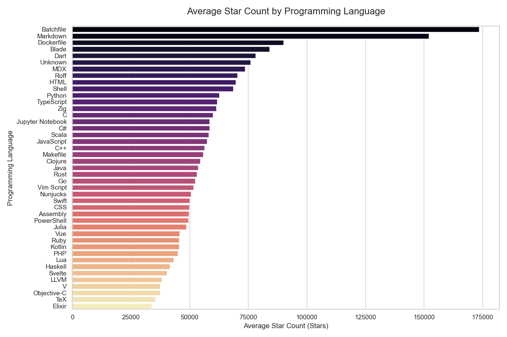
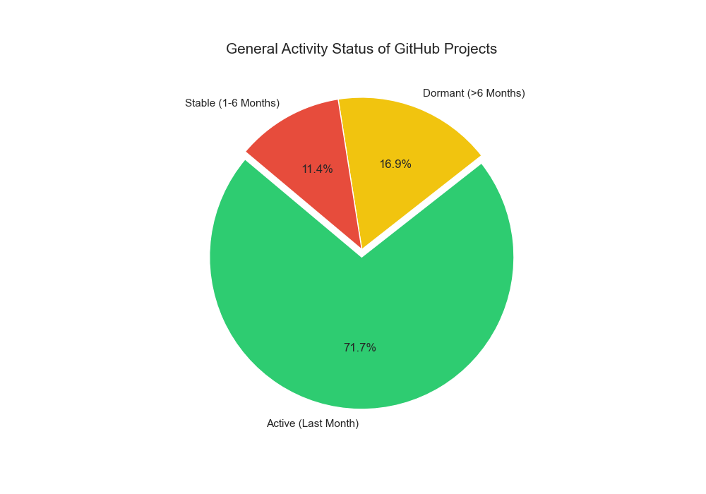
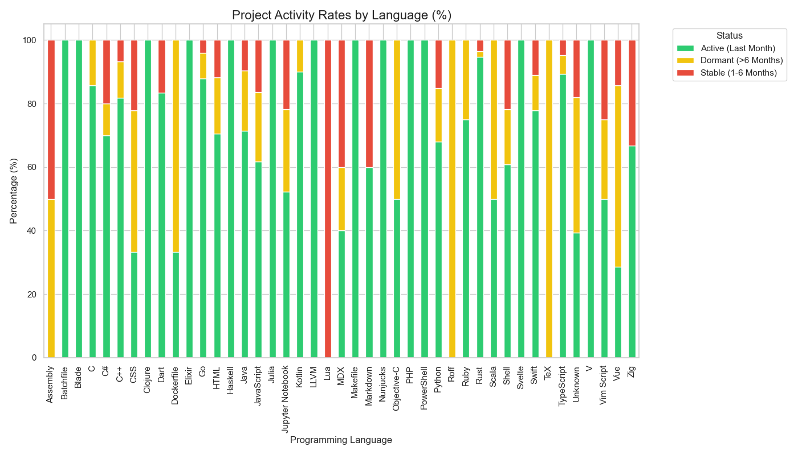
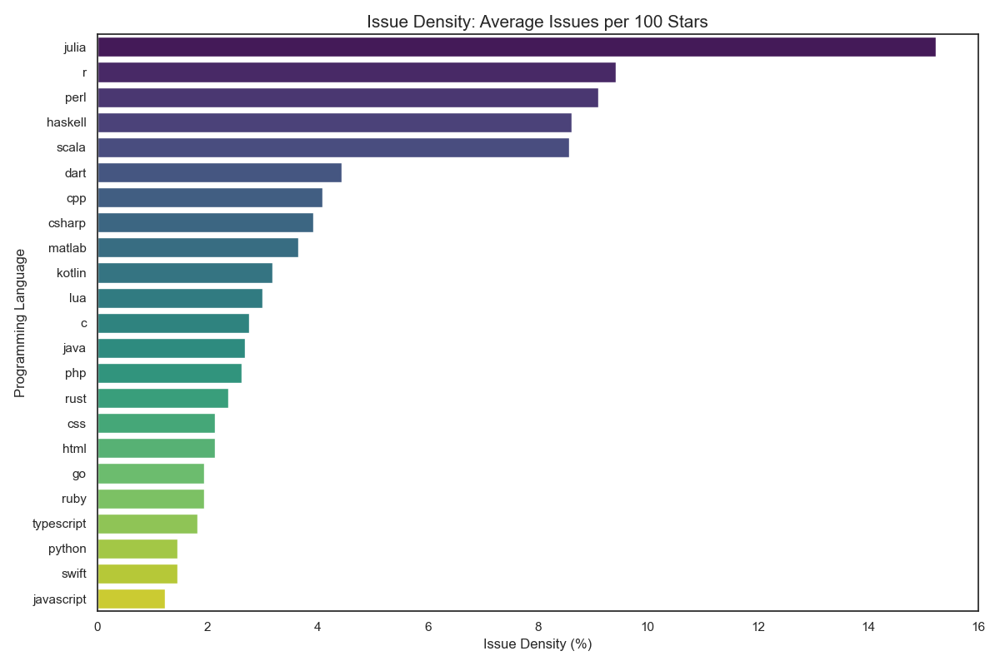
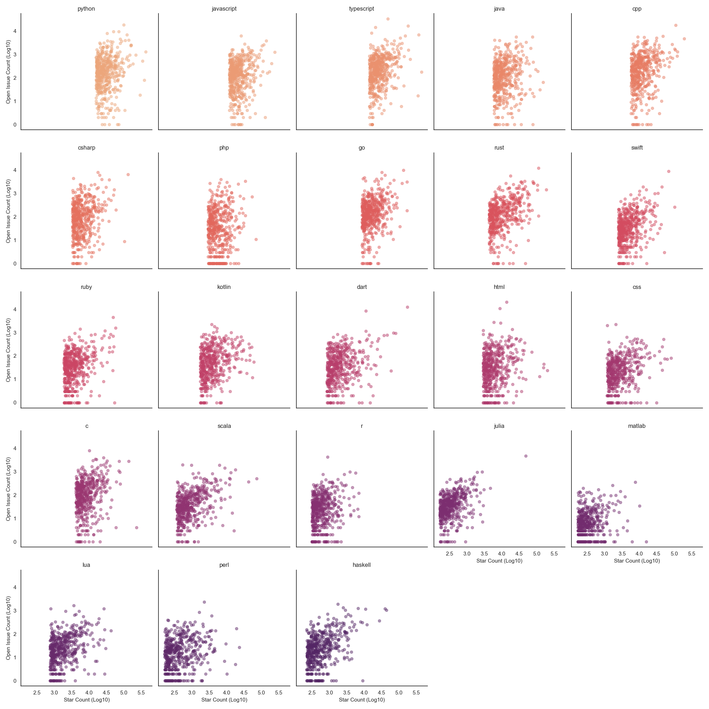
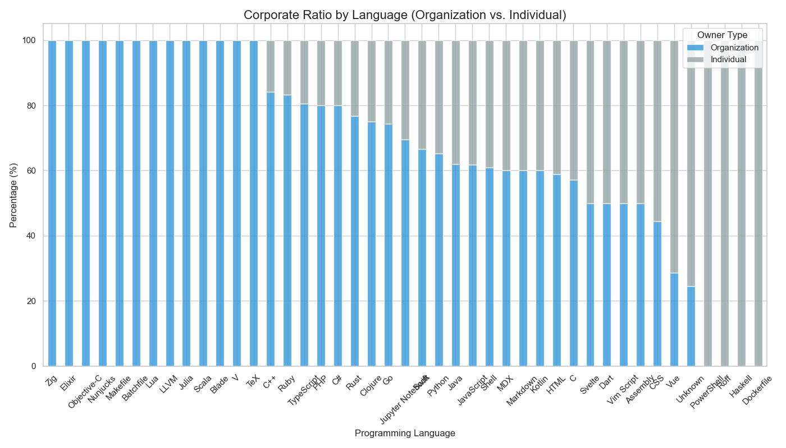
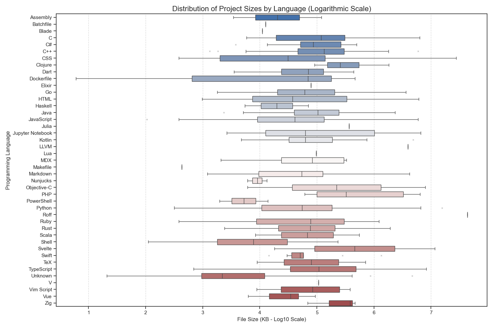

# 📊 GitHub Ecosystem: Comprehensive Data Analysis Report

This report has been prepared based on real-time data collected from GitHub and the visualizations derived from this data. The analysis covers popularity trends, project activity, issue density, ownership structures, and repository sizes across 23 different languages.

---

## 1. Popularity League (Average Star Count)
The popularity of languages on GitHub was analyzed based on the average number of stars per repository.

**Key Findings:**
* **Dominance of Utility Tools:** Tools like `Batchfile`, `Markdown`, and `Dockerfile` surprisingly have the highest average star counts. This is because projects in these formats are often "universal guides" or "base configurations" that appeal to the entire software ecosystem.
* **Mainstream Languages:** Languages like `Python`, `TypeScript`, and `C#` show a balanced popularity with a very wide distribution of projects.

---

## 2. Project Lifecycle and Activity
The recency of the ecosystem is classified based on the last "push" dates of the projects.

**General Status:**
* **High Dynamism:** **71.7% of the analyzed projects are "Active"** (updated within the last month).
* **Stagnation:** 16.9% of the projects have not been updated for more than 6 months, falling into the "Dormant" category.

**Distribution by Language:**
* `Rust`, `Go`, and `TypeScript` projects have the highest activity rates, while languages like `Objective-C` and `Vim Script` show a higher proportion of dormant projects.

---

## 3. Issue and Request Density (Issue Density)
The number of open issues per 100 stars indicates community engagement and the "maintenance load" of the project.

**Findings:**
* **Academic/Technical Languages:** Languages like `Julia`, `R`, `Perl`, and `Haskell` have the highest issue density. This suggests that these communities engage in deeper technical discussions and rigorous bug tracking.
* **Mainstream Consumer Languages:** `JavaScript` and `Python` projects have lower proportional issue density due to their massive star counts.

*(You can see the detailed relationship between Stars and Issues in the panel chart below)*

---

## 4. Corporate Ratio (Owner Type)
The management power behind the projects (Organization vs. Individual User) was analyzed.

**Analysis:**
* **Corporate Focus:** In languages like `Zig`, `Elixir`, and `Objective-C`, the corporate ownership rate is nearly 100%.
* **Community Driven:** In ecosystems like `Vue`, `PowerShell`, and `Haskell`, projects created by individual developers (`User`) occupy a much larger space.

---

## 5. Project Sizes and Distribution (Size)
The disk volumes (KB) of projects represent the technical "weight" and complexity of the languages.

**Results:**
* **Large-Scale Languages:** `C`, `C++`, and `Python` are the languages with the widest size distribution, ranging from tiny scripts to massive systems.
* **Compact Structures:** Projects in languages like `Makefile` and `Nunjucks` are clustered in more standard and smaller sizes.

---

## Conclusion
This data shows that GitHub is not just a place where code is shared, but a living organism. When choosing a technology, metrics such as **activity rate**, **corporate support**, and **issue density** should be evaluated together for a healthier decision-making process.

**👨‍💻Author: Alper - Management Information Systems (MIS) Student**

**[https://www.linkedin.com/in/alper-guler/]**
